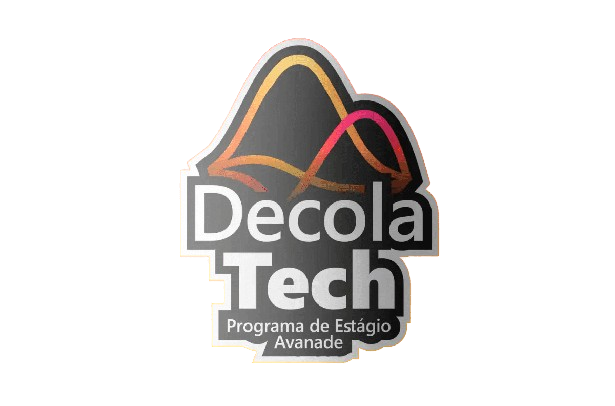

# Hey!
Bem vindo! Criei esse repositório com o intuito de relatar um pouco do meu progresso quanto ao Decola Tech 2024.
Esse programa é ofertado pela Avanade, onde contém trilhas educacionais online inteiramente focada em .NET, desta forma, eu, assim como outras pessoas, 
vamos aprender desde o básico até conceitos avançados ao desenvolver projetos práticos junto com experts da área. 

## A trilha é composta por: 

1. Mentorias (Live): Momento em que vamos nos inspirar nos talentos das empresas mais inovadoras do mundo, podendo interagir ao longo da live e até fazer perguntas sobre carreira e tecnologia.

2. Desafio de Código: Colocaremos em prática todo o conhecimento adquirido nas aulas para testar o nosso conhecimento na resolução de um desafio.

3. Desafio de Projeto: Construiremos o nosso portfólio elaborando projetos práticos com o conhecimento adquirido ao longo das aulas.

4. Ranking: Cada bootcamp possui um ranking com premiações exclusivas, onde vamos pontuando de acordo com as interações que realizamos em Fórum e Rooms, dos acertos que temos em questionários e da qualidade do código que vamos desenvolver nos desafios.

Logo, a medida que cada tópico vai sendo destrinchado, irei atualizar esse repositório. 

# Tópicos

1. [Introdução à lógica de programação e pensamento computacional](topico1) :heavy_check_mark: 

2. [Dominando a linguagem de programação C#](topico2) :construction: :construction_worker: :construction:

3. [Converções C# com desafios de código](topico3) :construction: :construction_worker: :construction:

4. [Orientação a Objetos com C#](topico4) :construction: :construction_worker: :construction:

5. [Praticando Orientação a Objetos com desafios de código em C#](topico5) :construction: :construction_worker: :construction: