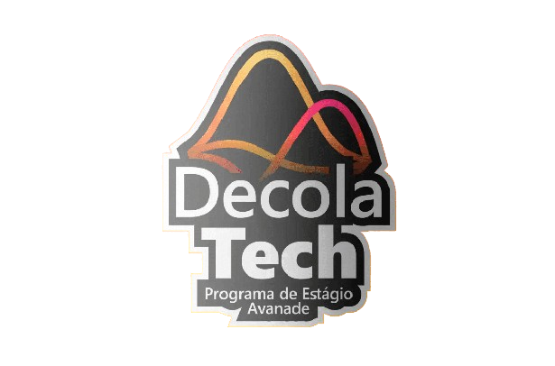
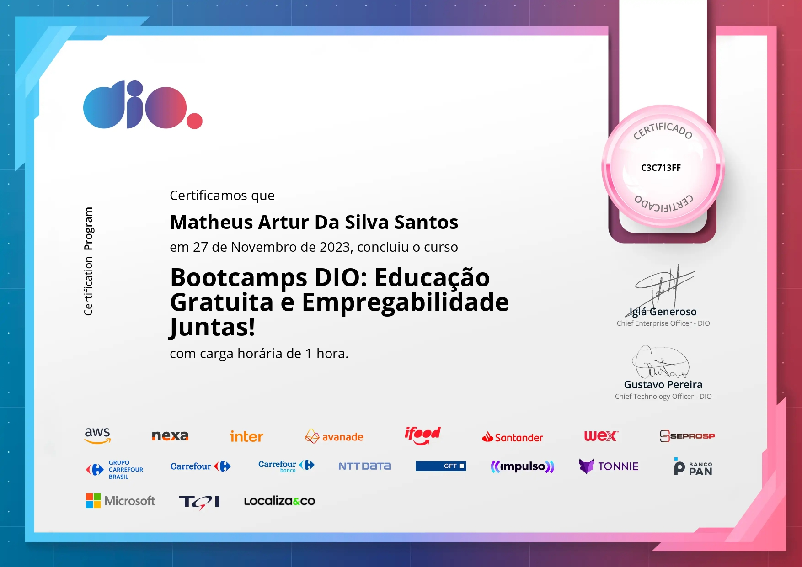
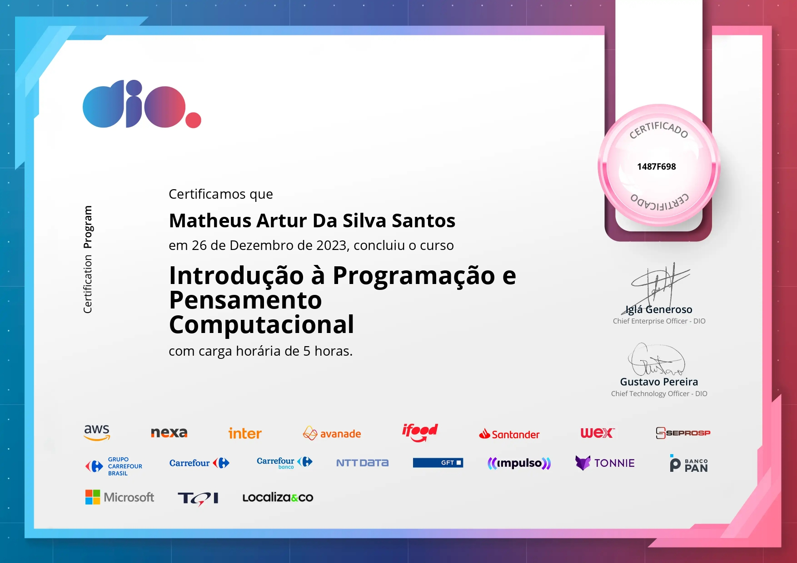

Introdução à Lógica de Programação e Pensamento Computacional

Neste primeiro tópico, conseguimos abordar sobre toda a lógica de programação utilizando o Portugol, assim como, 
tratamos sobre o Pensamento Computacional, analisando como o computador interpreta os códigos de alto nível. 

# Certificados 

1. Bootcamps DIO: Educação Gratuita e Empregabilidade Juntas!

2. Introdução à Programação e Pensamento Computacional 

3. Aula Inaugural - Decola Tech 2024

Neste subtópico, nos foi introduzido sobre o programa e tudo que vamos vivenciar ao decorrer dele, assim como, 
foi um momento para sanar as dúvidas e esclarecer alguns pontos. 