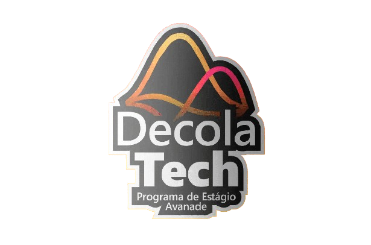
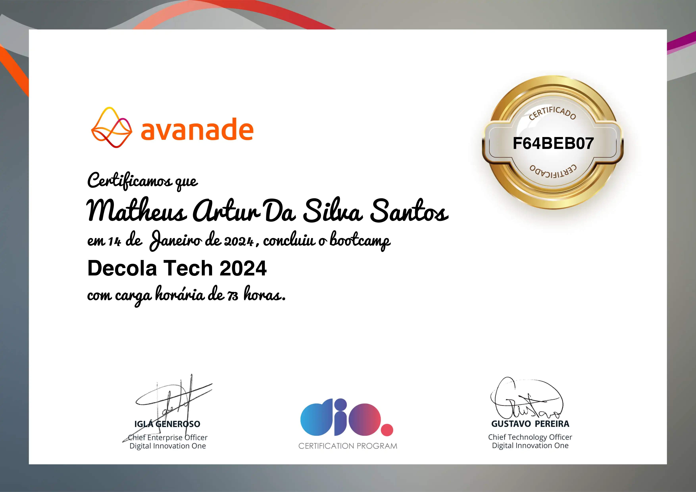

Praticando Orientação a Objetos Com Desafios de Código em C#

Nesse último tópico, tive a oportunidade de colocar em prática toda a teoria absorvida no tópico de "Orientação a Objetos em C#". Nele, consegui desenvolver 5 tipos de projetos onde os mesmos demandavam soluções especificas voltada ao paradigma da Programação Orientada a Objeto. Transpassei soluções que precisavam de conhecimentos 
voltados a herança, polimorfismo, dentre outras especificações da POO. Segue abaixo alguns pontos importantes ao discorrer desse 5° e último tópico. 

# Desafios Propostos

1. [Primeiro Desafio em POO:](codigos/codigo1.txt) :heavy_check_mark:

2. [Utilizando Propriedades e Métodos:](codigos/codigo2.txt) :heavy_check_mark:

3. [Criando um Objeto com Atributos:](codigos/codigo3.txt) :heavy_check_mark:

4. [Utilizando Construtores:](codigos/codigo4.txt) :heavy_check_mark:

5. [Utilizando Herança e Subclasses:](codigos/codigo5.txt) :heavy_check_mark:

# Certificado 

1. Finalização do tópico 5:

2. Finalização do Bootcamp:  

